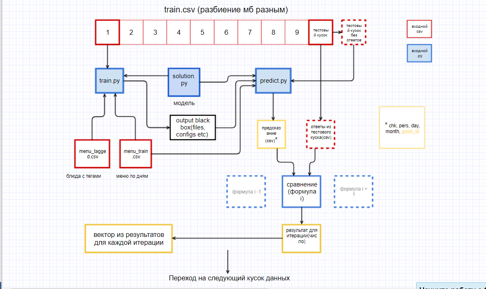

Tinkoff Cafe Web Wrapper
===========

Мы разрабатываем веб-обертку для помощи команде Tinkoff Cafe в тестировании их гипотез, в т.ч. проведении автоматической кросс-валидации и выведении результатов. 

Данная ветка работает на локалхосте с тунелем и кроссдоменными запросами от фронта, который хостится на github pages

[Фронтенд](https://github.com/python-am-cp/tinkoff_cafe_web_wrapper-front)

   
   Схема основной логики 
   ===============
   Мы получам от аналитиков: 
   + Название исследования
   + Описание исследования
   + Имя
   + Электронную почту
   
   + train.py -- обучающий скрипт
   + train.csv -- Все данные
   + menu-train.csv -- Меню по дням (вспомогательные выведенные данные)
   + menu-tagged.csv -- Блюда с тегами (вспомогательные выведенные данные)
   + predict.py -- скрипт-предсказатель
   + solution.py --модель
   
   Подробнее: [API аналитиков](https://github.com/python-am-cp/tinkoff_cafe/issues/17)
   
   Приложение должно разделить train.csv в некоторой пропорции и провести контрольные вычисления, включая различные формулы  сопоставления предсказания с ответами из тестовых данных. Результат в виде таблицы/векторов результатов по формулам пока что планируется присылать на электронную почту.
   
  
   Распределение обязанностей:
   ===========================
   **[Тимур](https://vk.com/subelta):**
   
   + Frontend 
   + Связь с бекендом
   + Деплой и работа сервера
   
   **[Артемий](https://vk.com/temimo):**
   
   + Организация хранения пользовательских данных
   + Запуск вычислений в нужное время и нужной последовательности 
   + Пересылка данных на email пользователей
   
   **[Александр](https://vk.com/papernyuk):**
   
   + Основная логика взаимодействия пользовательских файлов, вычисления, получение результата (см Схема)
   
   
   Используемые технологии в данной ветке:
   ========================
   + Фронтенд - HTML, CSS
   + Backend - Python Django
   + Инструменты - pycharm, vs code, ngrok, github, windows

